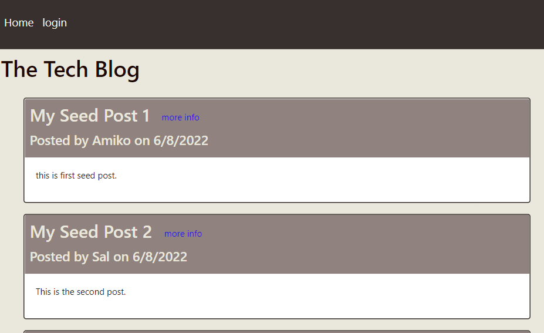
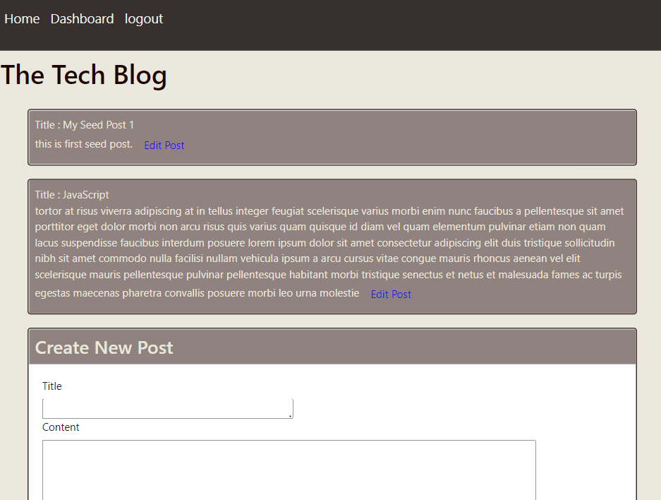
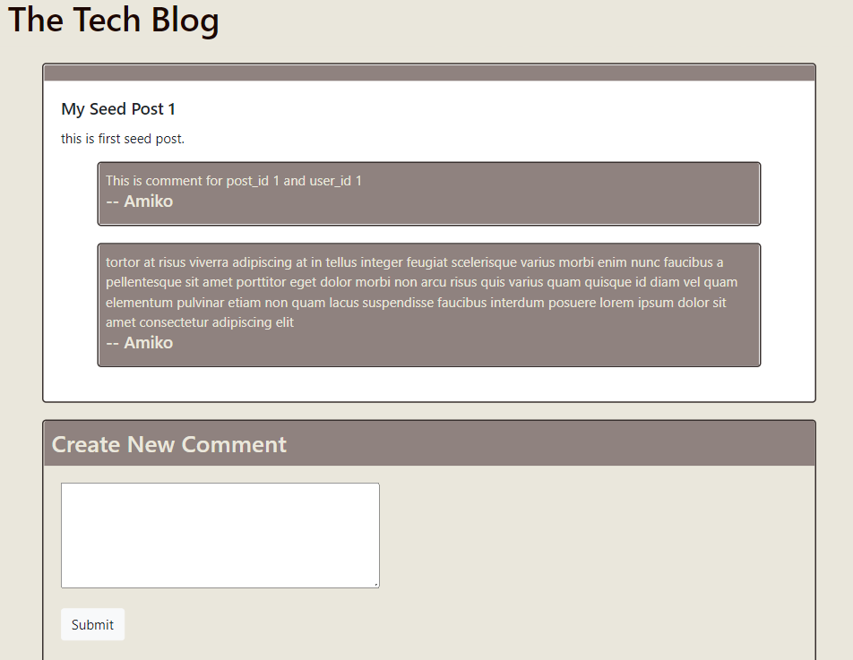

# Model-View-Controller-MVC-Tech-Blog

A CMS-style blog site similar to a Wordpress site, where developers can publish their blog posts and comment on other developers’ posts as well

## 

# Functionality of this app

- Platform for users to create different posts, updated and delete. User can also add and comments to posts as well. User Authentication is used for security purpose as well.

# Installation

- Download or clone repository.
- Node.js is required to run the application
- npm install to install the required packages as per package.json

# Usage

- use the following link to open the application
- The application will run on any browser.

# live application

[Tech Blog](https://techblogks.herokuapp.com/)

# ER Diagram

# Below are the sample pages of command line application

# Features and Technologies uses

- JavaScript
- Node.js
- Express.js
- sequelize
- mysql2
- express-session
- connect-session-sequelize

## Under the MIT license

